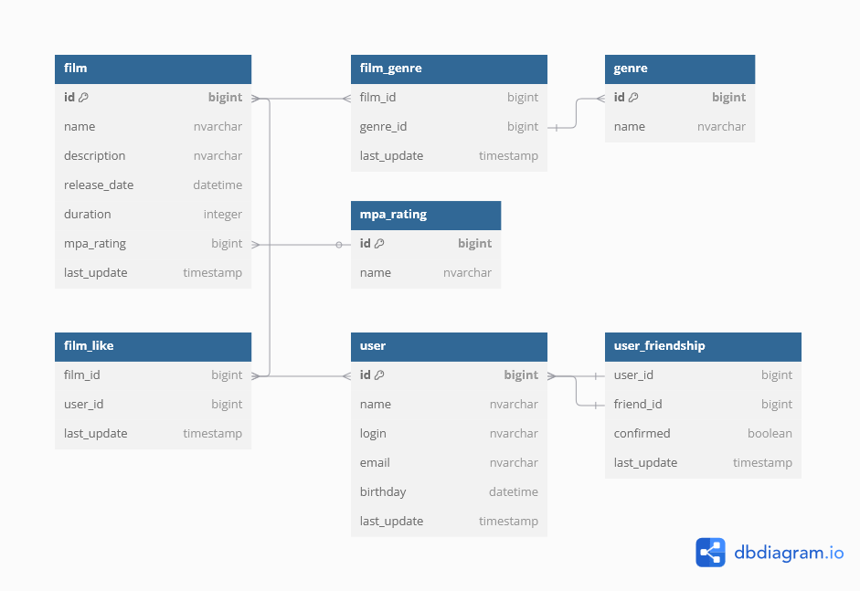

# java-filmorate
Полноценное приложение, которое умеет обрабатывать и хранить данные о пользователях и их любимых фильмах. 
Выбрать что-нибудь для просмотра за ужином больше не составит труда. Хеппи-энд и титры!

## Схема БД

## Описание таблиц

### film
*Таблица с информацией о фильмах*

| Поле         | Тип                    | Описание                                  |
|--------------|------------------------|-------------------------------------------|
| id           | bigint not null, pk    | Уникальный идентификатор                  |
| name         | nvarchar(128) not null | Название                                  |
| description  | nvarchar(200)          | Описание                                  |
| release_date | date                   | Дата выхода                               |
| duration     | integer                | Длительность фильма в минутах             |
| mpa_rating   | integer, fk mpa_rating | Рейтинг Ассоциации кинокомпаний           |
| last_update  | timestamp              | Дата и время последнего обновления записи |

### genre
*Таблица с информацией о жанрах*

| Поле         | Тип                    | Описание                        |
|--------------|------------------------|---------------------------------|
| id           | bigint not null, pk    | Уникальный идентификатор        |
| name         | nvarchar(128) not null | Название                        |

### film_genre
*Таблица связи фильмов с жанрами*

| Поле        | Тип                        | Описание                                  |
|-------------|----------------------------|-------------------------------------------|
| film_id     | bigint not null, fk film   | Ссылка на фильм                           |
| genre_id    | bigint not null, fk genre  | Ссылка на жанр                            |
| last_update | timestamp                  | Дата и время последнего обновления записи |

### mpa_rating
*Таблица с информацией о рейтинге Ассоциации кинокомпаний*

| Поле         | Тип                    | Описание                        |
|--------------|------------------------|---------------------------------|
| id           | bigint not null, pk    | Уникальный идентификатор        |
| name         | nvarchar(128) not null | Название                        |

### user
*Таблица с информацией о пользователях*

| Поле        | Тип                   | Описание                                  |
|-------------|-----------------------|-------------------------------------------|
| id          | bigint not null, pk   | Уникальный идентификатор                  |
| name        | nvarchar(128)         | Имя пользователя                          |
| login       | nvarchar(64) not null | Логин                                     |
| email       | nvarchar(64) not null | Email                                     |
| birthday    | date                  | Дата рождения                             |
| last_update | timestamp             | Дата и время последнего обновления записи |

### film_like
*Таблица связи фильмов с отметками пользователей*

| Поле        | Тип                      | Описание                                  |
|-------------|--------------------------|-------------------------------------------|
| film_id     | bigint not null, fk film | Ссылка на фильм                           |
| user_id     | bigint not null, fk user | Ссылка на пользователя                    |
| last_update | timestamp                | Дата и время последнего обновления записи |

### user_friendship
*Таблица с информацией о друзьях пользователя*

| Поле        | Тип                      | Описание                                  |
|-------------|--------------------------|-------------------------------------------|
| user_id     | bigint not null, fk user | Ссылка на пользователя                    |
| friend_id   | bigint not null, fk user | Ссылка на пользователя (является другом)  |
| confirmed   | boolean not null         | Признак что дружба подтверждена           |
| last_update | timestamp                | Дата и время последнего обновления записи |

